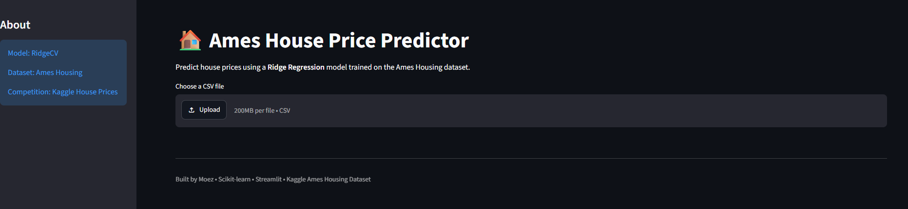

# 🏠 HomeWorth Predictor

A machine learning web application that predicts residential house prices using the **Ames Housing Dataset**. The project demonstrates an end-to-end machine learning workflow, from data preprocessing and feature engineering to model deployment with Streamlit.

## 🚀 Live Demo

https://predictnest.streamlit.app/

## 📊 Project Overview

This project was built to practice the complete machine learning pipeline:

* Data cleaning and preprocessing
* Missing value imputation
* Feature engineering
* Feature scaling and encoding
* Model training and evaluation
* Model serialization using Joblib
* Deployment with Streamlit

## 🤖 Model

* **Algorithm:** Ridge Regression (RidgeCV)
* **Target Transformation:** `TransformedTargetRegressor (log1p / expm1)`
* **Preprocessing:** `ColumnTransformer`
* **Categorical Encoding:** One-Hot Encoding & Ordinal Encoding
* **Missing Value Handling:** SimpleImputer
* **Feature Scaling:** StandardScaler

## 📈 Performance

| Metric        |       Score |
| ------------- | ----------: |
| Validation R² |    **0.91** |
| Kaggle RMSLE  | **0.15113** |

## 🛠️ Tech Stack

* Python
* Pandas
* NumPy
* Scikit-learn
* Joblib
* Streamlit

## 📁 Dataset

* **Dataset:** Ames Housing Dataset
* **Competition:** Kaggle House Prices – Advanced Regression Techniques

## 📸 Application Preview



## 📂 Repository Structure

```text
house-pricing-prediction/
├── images/
│   └── screenshot.png
├── app.py
├── house_price_model.pkl
├── house_price_prediction.ipynb
└── README.md
├── requirements.txt
├── runtime.txt
```

Built as a machine learning portfolio project to demonstrate an end-to-end regression workflow using Python and Scikit-learn.